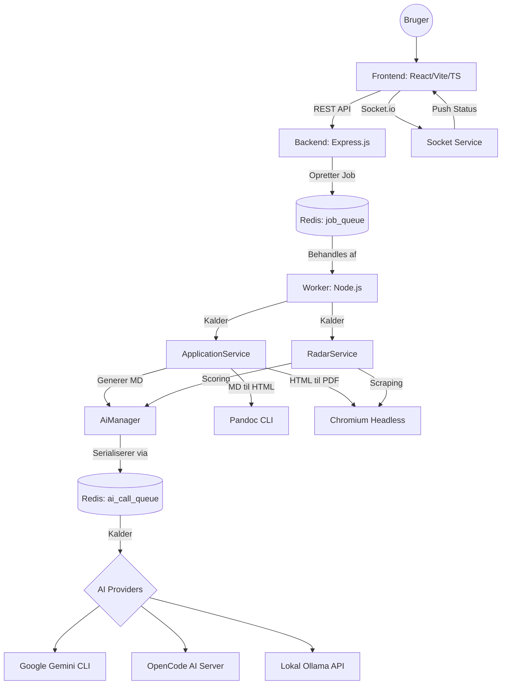

<!--
  Job Application Agent - Template Edition
  Softwaren leveres "som den er", uden nogen form for garanti.
  Brug af softwaren sker på eget ansvar.
-->

# Systemarkitektur: Job Application Agent Template (v6.1.0)

Dette dokument beskriver den overordnede arkitektur og tekniske opbygning af Job Application Agenten.

## 🏗 Overordnet Arkitektur

Systemet er bygget som en moderne **Producer-Consumer** arkitektur med en dobbelt kø-struktur for at sikre både parallel job-afvikling og seriel AI-eksekvering.

### Teknologistak

| Modul | Teknologi | Formål |
| :--- | :--- | :--- |
| **Frontend** | React, Vite, Tailwind | Brugerflade, live-preview og realtids-logs. |
| **Backend** | Express.js, Node.js | API Controllers, Services og orkestrering. |
| **Kø-system** | BullMQ, Redis | Håndtering af asynkrone jobs og AI-serielisering. |
| **AI Layer** | AiManager, Providers | Abstraktion, automatisk fallback og resilient parsing. |
| **Dokument-motor** | Pandoc, Chromium | Konvertering fra Markdown til HTML og PDF. |

## 🔍 Nøglekomponenter

### 1. Controllers & Services (Backend)
Systemet følger en striks opdeling mellem Controllers (der modtager API-kald) og Services (der indeholder forretningslogikken):
- **ApplicationService:** Orkestrerer generering af ansøgninger, CV'er og analyser.
- **RadarService:** Overvåger jobmarkedet og analyserer nye opslag autonomt.
- **SocketService:** Håndterer realtids-kommunikation til frontend via WebSockets.

### 2. AI-Abstraktion (AiManager)
For at sikre at systemet er uafhængigt af specifikke AI-udbydere, implementerer backenden en avanceret AI Manager:
- **Ai Call Queue:** En dedikeret BullMQ-kø (concurrency=1), der sikrer, at AI'en aldrig kaldes parallelt (vigtigt for rate-limits og Ollama).
- **Resilient Parsing:** Kan automatisk detektere og reparere fejlbehæftede JSON-svar fra mindre AI-modeller.
- **Provider Chain:** Forsøger automatisk næste provider (Gemini -> OpenCode -> Ollama) hvis et kald fejler eller timer ud.

### 3. Proaktiv Job-Radar
Et autonomt system der scorer jobs mod Master CV'et:
- **Headless Discovery:** Bruger Chromium til at indlæse komplekse websider og ekstrahere jobdata.
- **AI Match-Scoring:** Hvert job scores fra 0-100 af AI'en baseret på relevans før det præsenteres for brugeren.

### 4. Centraliseret Logging (The Golden Principle)
Systemet anvender en avanceret logger (`utils/logger.js`):
- **Vertikal Skanbarhed:** Alle logs følger et fast kolonneformat.
- **Ingen manuel trunkering:** Data sendes altid råt til loggeren, som selv styrer visningen baseret på verbosity-flag.

## 🔄 Det Logiske Workflow

Dette afsnit beskriver brugerrejsen og systemets logik fra start til slut.

1. **Datagrundlag (Initialisering)**
  * Systemet læser `brutto_cv.md` som den primære kilde (herunder personlige stamdata).
  * AI'en læser templates og instruktioner fra `/templates/`.

2. **Generering (Initial Flow)**
  * Brugeren indsætter jobtekst/URL og eventuelle hints.
  * Et job oprettes i `job_queue`.
  * Workeren kalder `ApplicationService`, som bruger AI'en til at skabe 4 dokumenter (Ansøgning, CV, Match, ICAN+).
  * Markdown konverteres til HTML (Pandoc) og PDF (Chromium).

3. **Iterativ Refinement**
  * Brugeren kan rette manuelt eller bede AI'en om at forfine et dokument med et nyt hint.
  * Systemet gemmer altid den nyeste state i mappen, så man kan fortsætte senere.

## 🛠 Eksterne Afhængigheder

1. **`gemini` (CLI):** Kræver API-nøgle for cloud-adgang (hovedmodel).
2. **`pandoc`:** Bruges til konvertering af Markdown til professionelt formateret HTML.
3. **`chromium-browser`:** Bruges både til PDF-generering og til scraping (via `--dump-dom`).

---
*Sidst opdateret: 8. april 2026 (v6.1.0)*
